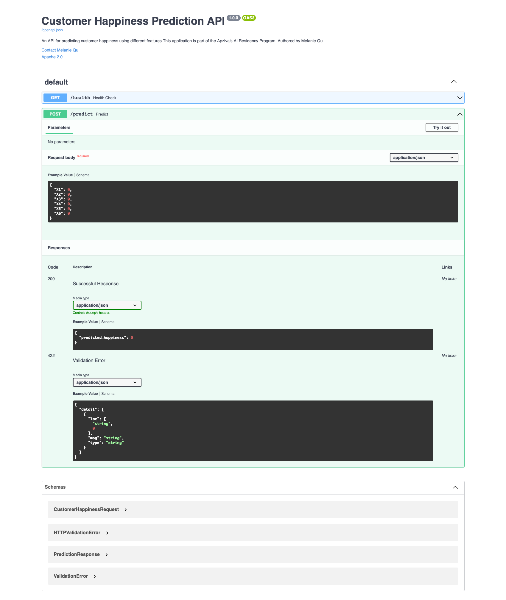

## Customer Happiness Project

The objective of the goal is to predict customers' happiness based on the following features of the logistic and delivery company. This is a supervised system, which means that the output of the model is labelled. The labels consist of two binary values, either 0 (unhappy) and 1 (happy). There are 6 variables or features, ranging from 1 to 5 and are defined as the following:

Data Description:

Y = target attribute (Y) with values indicating 0 (unhappy) and 1 (happy) customers

X1 = my order was delivered on time

X2 = contents of my order was as I expected

X3 = I ordered everything I wanted to order=

X4 = I paid a good price for my order

X5 = I am satisfied with my courier

X6 = the app makes ordering easy for me

## Exploratory Data Analysis & Preprocessing

This section is dedicated to uncovering different proprocessing methods to either remove outliers or replace them with the median value of the data points. I used a box-and-whisker plot to identify those outliers, which result in the skewness of the data (either left-skewed or right-skewed). Therefore, the approach I used is to replace the outliers with median of the column and the histogram later turned out more evenly distributed and showed less skewness. I also plotted a correlation chart, which shows the correlation for every paired combination between all the predictors and the label. Here you can see, as compared with Y, X1 has the greatest correlation (0.25), followed by X5 (0.18) and X6 (0.19). This later confirms our findings for feature selection, in which this combination (X1, X5, X6) gives the most accurate set of predictors for Y. 

## Project Structure

```text
Customer_Happiness/
├── data/
│   ├── raw/
│   │   └── ACME-HappinessSurvey2020.csv
│   └── processed/
│       └── ACME-HappinessSurvey2020.csv
│
├── src/
│   ├── api/
│   │   ├── inference.py
│   │   ├── main.py
│   │   ├── schemas.py
│   │   └── requirements.txt
│   │
│   ├── models/
│   │   ├── Training_model.py
│   │   ├── best_model.joblib
│   │   ├── requirements.txt
│   │   └── model_config.yaml
│   │
│   └── data/
│       └── Prerocessing.py
├── reports/
├── notebooks/
│   └── exploration/
│       └── EDA.ipynb
│
├── setup/
│   └── requirements.txt
│
├── .github/
│   └── workflows/
│       └── mlops-ci-pipeline.yaml
│
├── .gitignore
├── requirements.txt
├── Dockerfile
└── README.md
``` 
## Training models

The mission here is to train the dataset with all the possible machine learning algorithms. i also used a classifier package called LazyClassifier, which consists of different machine learning algorithms that are not included in the classifiers I have defined manually. 

However, the manually defined classifiers I was able to capture here are:
- Logistic Regression
- Random Forest Classifier
- Gradient Boosting Classifier
- LGBM Classifier
- Bernoulli NB
- Gaussian NB
- SGD Classifier
- NearestCentroid
- Perception
- Linear Discriminant Analysis
- Ridge Classifier
- Ridge Classifier CV
- XGBoostClassifier

## Feature Selection
I have used the xgboost model with binary:logistic as the objective and an assigned random state of 42. Here, I specified the number of features to 3 and the result used further along to train the model with the best selected features. 

As you can see from the model_config.yaml file, the best features are [X1, X5, X6]. This corresponds with the earlier prediction we had in EDA. As part of the preprocessing, I imported StandardScaler() and then fit-transformed it into input data, which is fed into the model.

I used mlflow package to track the different runs and it is hosted on the 5555 port. It is convenient for tracking each run and stores the metrics in a centralized location. I have defined a function called evaluate_model_with_grid which takes a model and determines the best hyperparameters for the said model and records its accuracy, mae, mse, rmse, r2, f1_score, and roc_auc. Later, the model with the highest accuracy is selected and stored in a .joblib file called best_model.joblib and its configuration in a .yaml file called model_config.yaml. 

Here is the outcome of the evaluation of different machine learning algorithms.

## Model Performance

| Classifier | Accuracy | MAE | RMSE | R² | F1 Score | ROC AUC |
|------------|----------|----------|----------|----------|----------|----------|
| Logistic Regression | 0.6538 | 0.3462 | 0.5883 | -0.3929 | 0.7273 | 0.7708 |
| Random Forest | 0.7692 | 0.2308 | 0.4804 | 0.0714 | 0.8125 | 0.7589 |
| Gradient Boosting | 0.7692 | 0.2308 | 0.4804 | 0.0714 | 0.8125 | 0.7500 |
| XGBoost | 0.8077 | 0.1923 | 0.4385 | 0.2262 | 0.8276 | 0.8363 |
| LightGBM | 0.7692 | 0.2308 | 0.4804 | 0.0714 | 0.7857 | 0.8363 |
| SGD Classifier | 0.5769 | 0.4231 | 0.6504 | -0.7024 | 0.6667 | 0.4911 |
| Bernoulli NB | 0.6923 | 0.3077 | 0.5547 | -0.2381 | 0.7333 | 0.7407 |
| Gaussian NB | 0.6538 | 0.3462 | 0.5883 | -0.3929 | 0.7097 | 0.8006 |
| Nearest Centroid | 0.6538 | 0.3462 | 0.5883 | -0.3929 | 0.6897 | 0.7887 |
| Perceptron | 0.7308 | 0.2692 | 0.5189 | -0.0833 | 0.7879 | 0.8125 |
| Linear Discriminant Analysis | 0.6538 | 0.3462 | 0.5883 | -0.3929 | 0.7273 | 0.7708 |
| Ridge Classifier | 0.6538 | 0.3462 | 0.5883 | -0.3929 | 0.7273 | 0.7708 |
| Ridge Classifier CV | 0.6538 | 0.3462 | 0.5883 | -0.3929 | 0.7273 | 0.7708 |

### Best Performing Model

| Model | Accuracy | F1 Score | ROC AUC |
|--------|----------|----------|----------|
| XGBoost | **0.8077** | **0.8276** | **0.8363** |

## Creating the API

I created a directory src/api/ in which I stored four different .py files used to create the API:

Inference.py : contains definition of method predict_happiness, which takes the 3 variables [X1, X5, X6], scale the input, and feed this into the best model. Then, a PredictionResponse is returned with the happiness value.

main.py : initializes FastAPI with metadata, add the CORS middleware. Then, I configured the health check and prediction endpoints. 

Schemas.py: initializes CustomerHappinessRequest with different fields and PredictionResponse with predicted_happiness.

## Continuous Integration and Continuous Deployment

I stored this yaml file in .github/workflows/ and this is triggered automatically when there is any pull or push request. I divided the workflow to 4 different stages, which are data processing, training the model, build and publish, and deploy to Hugging Face. Once CICD pipeline finishes running, one can find an interactive UI in which one can adjust the different values for X1 through X6 and receive an output signaling either 0 or 1.

Here is a screenshot of the Hugging Face UI which contains two sections, which are getting health status and predicting response:



You can use the predict functionality to determine the predicted happiness value using any combination of the six predictors.

## Conclusion

It was determined that the best set of features to predict a customer's happiness is [X1, X5, X6] and the best machine learning algorithm is xgboost classifier, which gives an accuracy level of approximately 0.81 and f1 score of 0.83.
